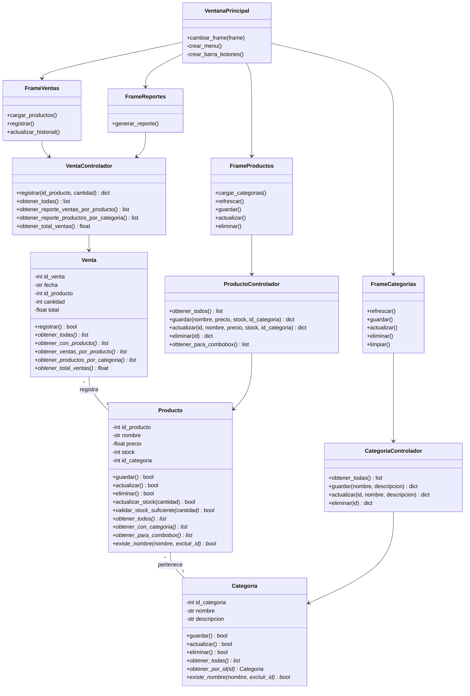
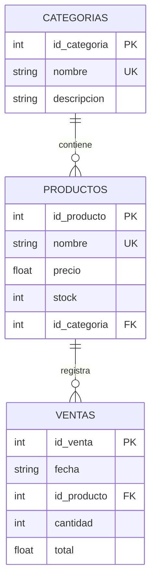

# MANUAL TÉCNICO DEL SOFTWARE
## Sistema de Inventario y Ventas

**Versión:** 1.0  
**Fecha:** Junio 2026    
**Distribución:** Ejecutable independiente (no requiere instalar Python)  
**Plataforma:** Windows, Linux, macOS  

---

## ÍNDICE

1. [Introducción](#introducción)
2. [Objetivo General del Sistema](#objetivo-general-del-sistema)
3. [Objetivos Específicos del Sistema](#objetivos-específicos-del-sistema)
4. [Requerimientos de Instalación](#requerimientos-de-instalación)
5. [Diagrama de Clases](#diagrama-de-clases)
6. [Diagrama Entidad-Relación](#diagrama-entidad-relación)
7. [Desarrollo](#desarrollo)
8. [Código de la Aplicación](#código-de-la-aplicación)

---

## INTRODUCCIÓN

El **Sistema de Inventario y Ventas** es una aplicación de escritorio que permite a las empresas gestionar de forma eficiente:

- **Categorización de productos:** Organizar productos por categorías
- **Control de inventario:** Registrar y actualizar stock de productos
- **Procesamiento de ventas:** Registrar transacciones comerciales
- **Generación de reportes:** Obtener análisis de ventas y inventario

La aplicación utiliza una arquitectura **Modelo-Vista-Controlador (MVC)** que garantiza:
- Separación de responsabilidades
- Mantenibilidad del código
- Reutilización de componentes
- Escalabilidad futura

**Tecnologías utilizadas:**
- **Distribución:** Ejecutable independiente para el usuario final
- **SQLite:** Base de datos relacional
- **POO:** Programación Orientada a Objetos

---

## OBJETIVO GENERAL DEL SISTEMA

Desarrollar una aplicación de gestión de inventario y ventas que permita a las pequeñas y medianas empresas:

**Automatizar y centralizar** la gestión de categorías de productos, inventario y registros de ventas, proporcionando una interfaz intuitiva que facilite el control y análisis de operaciones comerciales en tiempo real.

---

## OBJETIVOS ESPECÍFICOS DEL SISTEMA

### 1. **Gestión de Categorías**
   - Crear nuevas categorías de productos
   - Editar información de categorías existentes
   - Eliminar categorías (con validaciones de integridad)
   - Visualizar listado completo de categorías

### 2. **Gestión de Productos**
   - Registrar productos con nombre, precio y stock
   - Asociar productos a categorías
   - Actualizar precios y cantidades de stock
   - Eliminar productos (con validaciones)
   - Validar la unicidad de nombres de productos

### 3. **Registro de Ventas**
   - Registrar transacciones de venta
   - Validar disponibilidad de stock antes de vender
   - Actualizar automáticamente el inventario
   - Registrar fecha y hora de cada venta
   - Mantener histórico de transacciones

### 4. **Análisis y Reportes**
   - Generar reportes de ventas por producto
   - Mostrar cantidad total de productos por categoría
   - Calcular totales de ingresos
   - Visualizar datos en formato tabular

### 5. **Validaciones y Seguridad**
   - Validar que no haya categorías y productos duplicados
   - Prevenir eliminación de registros en uso
   - Validar valores numéricos (precios y cantidades)
   - Mostrar mensajes de error descriptivos

---

## REQUERIMIENTOS DE INSTALACIÓN

### REQUERIMIENTOS DE HARDWARE
- **Procesador:** Intel Core 2 Duo o superior
- **Memoria RAM:** Mínimo 512 MB
- **Espacio en disco:** 50 MB libres
- **Pantalla:** Resolución mínima 1024x768

### REQUERIMIENTOS DE SOFTWARE
- **Sistema Operativo:** Windows 7+, Linux (Ubuntu 18.04+), macOS 10.12+
- **Distribución:** Ejecutable independiente para cada plataforma. Los usuarios finales NO necesitan instalar Python.

### INSTALACIÓN Y EJECUCIÓN (USUARIO FINAL)

La versión certificada del sistema se entrega como un ejecutable independiente. No es necesario instalar Python ni ejecutar scripts.

- Windows: descargar `SistemaInventario.exe` y ejecutar con doble clic.
- Linux/macOS: utilizar el paquete/binario nativo proporcionado y seguir las instrucciones del proveedor.

Nota para desarrolladores: el código fuente puede estar implementado en Python, pero el entregable certificado debe ser un ejecutable listo para el uso final; no se requiere que los usuarios generen el .exe.

---

## DIAGRAMA DE CLASES



---

## DIAGRAMA ENTIDAD-RELACIÓN



### Descripción de Relaciones

| Relación | Tipo | Descripción |
|----------|------|-------------|
| CATEGORIAS → PRODUCTOS | 1:N | Una categoría contiene múltiples productos |
| PRODUCTOS → VENTAS | 1:N | Un producto puede tener múltiples ventas |

---

## DESARROLLO

### ESTRUCTURA DEL PROYECTO

```
gestion_inventario/
│
├── main.py                          # Punto de entrada
├── database.py                      # Gestión de base de datos
├── README.md                        # Guía técnica rápida
├── GUIA_RAPIDA.md                   # Manual de usuario
├── MANUAL_TECNICO.md                # Este archivo
│
├── modelos/                         # Capa de Modelos (POO)
│   ├── __init__.py
│   ├── categoria.py                 # Clase Categoria
│   ├── producto.py                  # Clase Producto
│   └── venta.py                     # Clase Venta
│
├── controladores/                   # Capa de Controladores (Lógica)
│   ├── __init__.py
│   ├── categoria_controlador.py      # Lógica de categorías
│   ├── producto_controlador.py       # Lógica de productos
│   └── venta_controlador.py          # Lógica de ventas
│
├── vistas/                          # Capa de Vistas (Interfaz)
│   ├── __init__.py
│   ├── ventana_principal.py          # Ventana principal
│   ├── frame_categorias.py           # Interfaz categorías
│   ├── frame_productos.py            # Interfaz productos
│   ├── frame_ventas.py               # Interfaz ventas
│   └── frame_reportes.py             # Interfaz reportes
│
└── db/                              # Base de datos
    └── inventario.db                # SQLite (se crea automáticamente)
```

### FLUJO DE LA APLICACIÓN

```
1. INICIO
   ↓
2. Ejecutar main.py
   ├─ Importar módulos
   ├─ Inicializar base de datos (iniciar_bd())
   ├─ Crear ventana principal (Tkinter)
   └─ Crear frames (Categorías, Productos, Ventas, Reportes)
   ↓
3. VENTANA PRINCIPAL
   ├─ Menú (Archivo, Gestión, Reportes, Ayuda)
   ├─ Barra de botones
   └─ Frame dinámico (cambia según selección)
   ↓
4. USUARIO INTERACTÚA
   ├─ Selecciona opción del menú o botón
   ├─ Frame se actualiza
   ├─ Usuario ingresa datos
   └─ Usuario hace clic en botón (Guardar, Actualizar, Eliminar, etc.)
   ↓
5. PROCESAMIENTO
   ├─ Frame llama al Controlador
   ├─ Controlador valida datos
   ├─ Controlador llama al Modelo
   ├─ Modelo realiza operación en BD
   └─ Controlador retorna resultado
   ↓
6. ACTUALIZACIÓN VISUAL
   ├─ Frame recibe resultado
   ├─ Muestra mensaje (éxito/error)
   ├─ Recarga tabla si es necesario
   └─ Limpia campos de entrada
   ↓
7. CICLO REPETITIVO O SALIDA
   ├─ Usuario continúa operando
   └─ Usuario cierra aplicación
```

### PATRONES DE DISEÑO UTILIZADOS

#### 1. **Modelo-Vista-Controlador (MVC)**
- **Modelo:** Clases Categoria, Producto, Venta
- **Vista:** Frames (frame_categorias, frame_productos, etc.)
- **Controlador:** Controladores (*_controlador.py)

#### 2. **Patrón Singleton** (Base de Datos)
```python
# database.py usa singleton implícito
# Siempre se conecta a la misma BD
conexion = conectar()
```

#### 3. **Patrón Factory** (Creación de Frames)
```python
# ventana_principal.py crea frames dinámicamente
self.frame_categorias = FrameCategorias(root, self)
```

#### 4. **Patrón Observer** (Eventos de Tkinter)
```python
# frame_productos.py observa eventos de selección
self.tree.bind('<<TreeviewSelect>>', self.on_select)
```

### VALIDACIONES IMPLEMENTADAS

| Entidad | Validación | Acción |
|---------|-----------|--------|
| Categoría | Nombre vacío | Mostrar error |
| Categoría | Nombre duplicado | Mostrar error |
| Categoría | Eliminar con productos | Bloquear eliminación |
| Producto | Nombre vacío | Mostrar error |
| Producto | Nombre duplicado | Mostrar error |
| Producto | Precio negativo | Mostrar error |
| Producto | Stock negativo | Mostrar error |
| Producto | Categoría inexistente | Mostrar error |
| Producto | Eliminar con ventas | Bloquear eliminación |
| Venta | Cantidad <= 0 | Mostrar error |
| Venta | Stock insuficiente | Mostrar error |

### CONSULTAS SQL IMPLEMENTADAS

| Tipo | Ubicación | Descripción |
|------|-----------|-------------|
| SELECT | obtener_todas() | Obtener todos los registros |
| SELECT WHERE | obtener_por_id() | Obtener registro específico |
| INSERT | guardar() | Insertar nuevo registro |
| UPDATE | actualizar() | Actualizar registro existente |
| UPDATE | actualizar_stock() | Reducir stock después de venta |
| DELETE | eliminar() | Eliminar registro con validaciones |
| JOIN | obtener_con_categoria() | Producto + nombre de categoría |
| JOIN | obtener_con_producto() | Venta + nombre de producto |
| GROUP BY | obtener_ventas_por_producto() | Agrupar ventas por producto |
| GROUP BY COUNT | obtener_productos_por_categoria() | Contar productos por categoría |
| SUM | obtener_total_ventas() | Sumar totales de ventas |

---

## CÓDIGO DE LA APLICACIÓN

### 1. database.py - Gestión de Base de Datos

```python
import sqlite3
import os
from pathlib import Path

# Obtener la ruta de la base de datos
DB_PATH = os.path.join(os.path.dirname(__file__), 'db', 'inventario.db')

def conectar():
    """Retorna una conexión a la base de datos SQLite"""
    conexion = sqlite3.connect(DB_PATH)
    conexion.row_factory = sqlite3.Row
    return conexion

def crear_tablas():
    """Ejecuta las sentencias CREATE TABLE IF NOT EXISTS"""
    conexion = conectar()
    cursor = conexion.cursor()
    
    # Crear tabla categorias
    cursor.execute('''
        CREATE TABLE IF NOT EXISTS categorias (
            id_categoria INTEGER PRIMARY KEY AUTOINCREMENT,
            nombre TEXT UNIQUE NOT NULL,
            descripcion TEXT
        )
    ''')
    
    # Crear tabla productos
    cursor.execute('''
        CREATE TABLE IF NOT EXISTS productos (
            id_producto INTEGER PRIMARY KEY AUTOINCREMENT,
            nombre TEXT UNIQUE NOT NULL,
            precio REAL NOT NULL CHECK (precio >= 0),
            stock INTEGER NOT NULL CHECK (stock >= 0),
            id_categoria INTEGER NOT NULL,
            FOREIGN KEY (id_categoria) REFERENCES categorias(id_categoria)
        )
    ''')
    
    # Crear tabla ventas
    cursor.execute('''
        CREATE TABLE IF NOT EXISTS ventas (
            id_venta INTEGER PRIMARY KEY AUTOINCREMENT,
            fecha TEXT NOT NULL,
            id_producto INTEGER NOT NULL,
            cantidad INTEGER NOT NULL CHECK (cantidad > 0),
            total REAL NOT NULL CHECK (total >= 0),
            FOREIGN KEY (id_producto) REFERENCES productos(id_producto)
        )
    ''')
    
    # Crear índices
    cursor.execute('CREATE INDEX IF NOT EXISTS idx_productos_categoria ON productos(id_categoria)')
    cursor.execute('CREATE INDEX IF NOT EXISTS idx_ventas_producto ON ventas(id_producto)')
    cursor.execute('CREATE INDEX IF NOT EXISTS idx_ventas_fecha ON ventas(fecha)')
    
    conexion.commit()
    conexion.close()

def iniciar_bd():
    """Crea la base de datos e inicializa las tablas"""
    # Crear carpeta db si no existe
    db_dir = os.path.dirname(DB_PATH)
    if not os.path.exists(db_dir):
        os.makedirs(db_dir)
    
    # Crear tablas
    crear_tablas()
```

### 2. modelos/categoria.py - Clase Categoria

```python
import sqlite3
from database import conectar

class Categoria:
    def __init__(self, nombre, descripcion=""):
        self.id_categoria = None
        self.nombre = nombre
        self.descripcion = descripcion
    
    def guardar(self):
        """Guarda una nueva categoría en la base de datos"""
        try:
            conexion = conectar()
            cursor = conexion.cursor()
            cursor.execute(
                'INSERT INTO categorias (nombre, descripcion) VALUES (?, ?)',
                (self.nombre, self.descripcion)
            )
            self.id_categoria = cursor.lastrowid
            conexion.commit()
            conexion.close()
            return True
        except sqlite3.IntegrityError:
            return False
    
    def actualizar(self):
        """Actualiza los datos de una categoría existente"""
        try:
            conexion = conectar()
            cursor = conexion.cursor()
            cursor.execute(
                'UPDATE categorias SET nombre = ?, descripcion = ? WHERE id_categoria = ?',
                (self.nombre, self.descripcion, self.id_categoria)
            )
            conexion.commit()
            conexion.close()
            return True
        except sqlite3.IntegrityError:
            return False
    
    def eliminar(self):
        """Elimina una categoría de la base de datos"""
        try:
            conexion = conectar()
            cursor = conexion.cursor()
            # Verificar que no tenga productos asociados
            cursor.execute('SELECT COUNT(*) FROM productos WHERE id_categoria = ?', 
                         (self.id_categoria,))
            if cursor.fetchone()[0] > 0:
                conexion.close()
                return False
            
            cursor.execute('DELETE FROM categorias WHERE id_categoria = ?', 
                         (self.id_categoria,))
            conexion.commit()
            conexion.close()
            return True
        except Exception:
            return False
    
    @classmethod
    def obtener_todas(cls):
        """Retorna todas las categorías de la base de datos"""
        try:
            conexion = conectar()
            cursor = conexion.cursor()
            cursor.execute('SELECT * FROM categorias ORDER BY nombre')
            filas = cursor.fetchall()
            conexion.close()
            return filas
        except Exception:
            return []
    
    @classmethod
    def obtener_por_id(cls, id_categoria):
        """Retorna una categoría por su ID"""
        try:
            conexion = conectar()
            cursor = conexion.cursor()
            cursor.execute('SELECT * FROM categorias WHERE id_categoria = ?', 
                         (id_categoria,))
            fila = cursor.fetchone()
            conexion.close()
            return fila
        except Exception:
            return None
    
    @classmethod
    def existe_nombre(cls, nombre, excluir_id=None):
        """Valida si un nombre de categoría ya existe"""
        try:
            conexion = conectar()
            cursor = conexion.cursor()
            if excluir_id:
                cursor.execute(
                    'SELECT COUNT(*) FROM categorias WHERE nombre = ? AND id_categoria != ?',
                    (nombre, excluir_id)
                )
            else:
                cursor.execute('SELECT COUNT(*) FROM categorias WHERE nombre = ?', (nombre,))
            
            resultado = cursor.fetchone()[0] > 0
            conexion.close()
            return resultado
        except Exception:
            return False
```

### 3. modelos/producto.py - Clase Producto

```python
import sqlite3
from database import conectar

class Producto:
    def __init__(self, nombre, precio, stock, id_categoria):
        self.id_producto = None
        self.nombre = nombre
        self.precio = precio
        self.stock = stock
        self.id_categoria = id_categoria
    
    def guardar(self):
        """Guarda un nuevo producto en la base de datos"""
        try:
            conexion = conectar()
            cursor = conexion.cursor()
            cursor.execute(
                'INSERT INTO productos (nombre, precio, stock, id_categoria) VALUES (?, ?, ?, ?)',
                (self.nombre, self.precio, self.stock, self.id_categoria)
            )
            self.id_producto = cursor.lastrowid
            conexion.commit()
            conexion.close()
            return True
        except sqlite3.IntegrityError:
            return False
    
    def actualizar(self):
        """Actualiza los datos de un producto existente"""
        try:
            conexion = conectar()
            cursor = conexion.cursor()
            cursor.execute(
                'UPDATE productos SET nombre = ?, precio = ?, stock = ?, id_categoria = ? WHERE id_producto = ?',
                (self.nombre, self.precio, self.stock, self.id_categoria, self.id_producto)
            )
            conexion.commit()
            conexion.close()
            return True
        except sqlite3.IntegrityError:
            return False
    
    def eliminar(self):
        """Elimina un producto de la base de datos"""
        try:
            conexion = conectar()
            cursor = conexion.cursor()
            # Verificar que no tenga ventas asociadas
            cursor.execute('SELECT COUNT(*) FROM ventas WHERE id_producto = ?', 
                         (self.id_producto,))
            if cursor.fetchone()[0] > 0:
                conexion.close()
                return False
            
            cursor.execute('DELETE FROM productos WHERE id_producto = ?', 
                         (self.id_producto,))
            conexion.commit()
            conexion.close()
            return True
        except Exception:
            return False
    
    def actualizar_stock(self, cantidad):
        """Reduce el stock de un producto"""
        try:
            conexion = conectar()
            cursor = conexion.cursor()
            cursor.execute(
                'UPDATE productos SET stock = stock - ? WHERE id_producto = ?',
                (cantidad, self.id_producto)
            )
            conexion.commit()
            conexion.close()
            return True
        except Exception:
            return False
    
    def validar_stock_suficiente(self, cantidad):
        """Verifica si hay stock suficiente para la cantidad solicitada"""
        try:
            conexion = conectar()
            cursor = conexion.cursor()
            cursor.execute('SELECT stock FROM productos WHERE id_producto = ?', 
                         (self.id_producto,))
            fila = cursor.fetchone()
            conexion.close()
            
            if fila:
                return fila['stock'] >= cantidad
            return False
        except Exception:
            return False
    
    @classmethod
    def obtener_todos(cls):
        """Retorna todos los productos de la base de datos"""
        try:
            conexion = conectar()
            cursor = conexion.cursor()
            cursor.execute('SELECT * FROM productos ORDER BY nombre')
            filas = cursor.fetchall()
            conexion.close()
            return filas
        except Exception:
            return []
    
    @classmethod
    def obtener_por_id(cls, id_producto):
        """Retorna un producto por su ID"""
        try:
            conexion = conectar()
            cursor = conexion.cursor()
            cursor.execute('SELECT * FROM productos WHERE id_producto = ?', 
                         (id_producto,))
            fila = cursor.fetchone()
            conexion.close()
            return fila
        except Exception:
            return None
    
    @classmethod
    def obtener_con_categoria(cls):
        """Retorna todos los productos con su categoría"""
        try:
            conexion = conectar()
            cursor = conexion.cursor()
            cursor.execute('''
                SELECT p.*, c.nombre as nombre_categoria
                FROM productos p
                JOIN categorias c ON p.id_categoria = c.id_categoria
                ORDER BY p.nombre
            ''')
            filas = cursor.fetchall()
            conexion.close()
            return filas
        except Exception:
            return []
    
    @classmethod
    def existe_nombre(cls, nombre, excluir_id=None):
        """Valida si un nombre de producto ya existe"""
        try:
            conexion = conectar()
            cursor = conexion.cursor()
            if excluir_id:
                cursor.execute(
                    'SELECT COUNT(*) FROM productos WHERE nombre = ? AND id_producto != ?',
                    (nombre, excluir_id)
                )
            else:
                cursor.execute('SELECT COUNT(*) FROM productos WHERE nombre = ?', (nombre,))
            
            resultado = cursor.fetchone()[0] > 0
            conexion.close()
            return resultado
        except Exception:
            return False
    
    @classmethod
    def obtener_para_combobox(cls):
        """Retorna lista de productos para Combobox"""
        try:
            conexion = conectar()
            cursor = conexion.cursor()
            cursor.execute('SELECT id_producto, nombre FROM productos ORDER BY nombre')
            filas = cursor.fetchall()
            conexion.close()
            return filas
        except Exception:
            return []
```

### 4. main.py - Punto de Entrada

```python
import tkinter as tk
from database import iniciar_bd
from vistas.ventana_principal import VentanaPrincipal

def main():
    """Función principal para iniciar la aplicación"""
    # Inicializar base de datos
    iniciar_bd()
    
    # Crear ventana principal
    root = tk.Tk()
    
    # Crear aplicación
    app = VentanaPrincipal(root)
    
    # Ejecutar
    root.mainloop()

if __name__ == "__main__":
    main()
```

### 5. vistas/ventana_principal.py - Ventana Principal (Extracto)

```python
import tkinter as tk
from tkinter import messagebox
from vistas.frame_categorias import FrameCategorias
from vistas.frame_productos import FrameProductos
from vistas.frame_ventas import FrameVentas
from vistas.frame_reportes import FrameReportes

class VentanaPrincipal:
    def __init__(self, root):
        self.root = root
        self.root.title("Sistema de Inventario y Ventas")
        self.root.geometry("900x600")
        
        # Crear frames
        self.frame_categorias = FrameCategorias(root, self)
        self.frame_productos = FrameProductos(root, self)
        self.frame_ventas = FrameVentas(root, self)
        self.frame_reportes = FrameReportes(root, self)
        
        # Frame actual
        self.frame_actual = None
        
        # Crear menú
        self._crear_menu()
        
        # Crear barra de botones
        self._crear_barra_botones()
        
        # Mostrar pantalla inicial
        self.cambiar_frame(self._crear_pantalla_inicio())
    
    def cambiar_frame(self, nuevo_frame):
        """Cambia el frame actual por uno nuevo"""
        if self.frame_actual:
            self.frame_actual.pack_forget()
        
        self.frame_actual = nuevo_frame
        self.frame_actual.pack(fill=tk.BOTH, expand=True, padx=10, pady=5)
```

---

## INFORMACIÓN DE CONTATO Y SOPORTE

**Desarrollado por:**  Luis Manuel Morales 
**Fecha de Desarrollo:** Junio 2026  
**Versión Actual:** 1.0  

### Para reportar problemas:
### Para reportar problemas:
1. Verificar que el ejecutable `SistemaInventario.exe` (o el binario entregado) se haya ejecutado correctamente
2. Revisar archivo GUIA_RAPIDA.md para soluciones comunes
3. Incluir evidencia (capturas, logs) y contactar al equipo de desarrollo

---

## CONCLUSIÓN

El **Sistema de Inventario y Ventas** es una aplicación robusta, escalable y mantenible que implementa correctamente los principios de Programación Orientada a Objetos y el patrón Modelo-Vista-Controlador. 

La arquitectura modular permite futuras expansiones como:
- Integración con múltiples usuarios
- Base de datos en servidor remoto
- Exportación de datos a Excel
- Sistema de respaldos automáticos
- Módulo de usuarios y permisos

---

**Fin del Manual Técnico**
